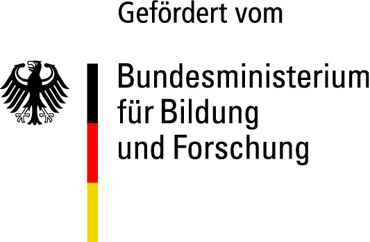

# WISYKI-API

The WISYKI-API is a tool developed as part of the [WISY@KI project](https://www.wisyki.de/) that provides capabilities to predict [ESCOv1.2.0](https://esco.ec.europa.eu/), [GRETAv2](https://www.greta-die.de/webpages/greta-interaktiv), and DKZ Skills based on given course descriptions or learning outcomes. Predictions include learning outcomes, prerequisites, keywords and competency levels.

The application leverages two fine-tuned models:

1. [Finetuned Embedding Model](https://huggingface.co/isy-thl/multilingual-e5-base-course-skill-tuned): A derivative of the embedding model [intfloat/multilingual-e5-base](https://huggingface.co/intfloat/multilingual-e5-base), this model was optimized to retrieve the most relevant skills from a vectordatabase based on german course descriptions.

2. [Finetuned Reranker](https://huggingface.co/isy-thl/bge-reranker-base-course-skill-tuned): This model, a fine-tuned version of the cross-encoder model [BAAI/bge-reranker-base](https://huggingface.co/BAAI/bge-reranker-base), is employed for the validation and reranking of skill predictions.

The fine-tuning of these models was executed using a diverse set of training data. This data, which includes learning outcomes along with positive and negative labels representing ESCO and GRETA skills, was sourced from the INVITE projects GRETA, MYEdULife, and WISY@KI. Additionally, synthetic data, generated through the LLM validation model (mistral-medium) available in this API, was incorporated into the training process to enhance diversity, especially considering the scarcity of human-validated training data.
While earlier versions used synthetic training data to increase diversity, the update models were trained on human validated data exclusively.

In addition to the above models, the WISYKI-API also uses other models via their APIs for learning outcome extraction and LLM validation. Depending on the request, the following models are used:

For learning outcome extraction, one of the following models is used:

1. Llama 3 8B (hosted in SH by myLab@THL)
2. mistral-small (API key required)
3. gpt-3.5-turbo-1106 (API key required)

For more challenging tasks like validation, one of the following models is used:

1. Mixtral-8x7B (hosted in SH by myLab@THL)
2. mistral-large (API key required)
3. gpt-4o (API key required)

Please note that some of these models require an API key for access.

## Features

* Predict ESCOv1.2.0, GRETAv2, and DKZ Skills based on course descriptions or learning outcomes.
* Predict competency levels.
* Create embeddings.
* Provide validated training data.

## Installation

To get the API up and running, follow these steps:

### Prerequisites

You will need to have Docker installed on your machine. If you don't have Docker installed, you can download it from [the official docker website](https://www.docker.com/products/docker-desktop).

### Environment Variables

The following environment variables are required:

* `POSTGRES_PASSWORD`: The password for the PostgreSQL database.
* `PGADMIN_EMAIL`: The email for PgAdmin.
* `PGADMIN_PASSWORD`: The password for PgAdmin.
* `HOST_PORT`: The host port.
* `POSTGRES_PORT`: The port for the PostgreSQL database.
* `PGADMIN_PORT`: The port for PgAdmin.
* `ROOT_PATH`: This variable is used when the API is running behind a proxy. If the API is served under a subpath, such as `/api/v1`, then `ROOT_PATH` should be set to that subpath (`/api/v1` in this case). If the API is not behind a proxy or is served from the root path, this variable can be left empty.

### Steps

1. Clone the repository:

    ```bash
    git clone <repository-url>
    ```

2. Navigate to the project directory:

    ```bash
    cd wisyki-api
    ```

3. Run the Docker compose command:

    ```bash
    docker-compose up -d
    ```

Alternatively, you can pull the Docker image from Docker Hub:

```bash
docker pull pascalhuerten/comp-ai-api:latest
```

## API Documentation

For more details on how to use the API, please refer to the [API Documentation](https://ai-isy.th-luebeck.de/competence-analyser/redoc).

## Acknowledgements

This service uses the ESCO classification of the European Commission.

This API was developed as part of the project WISY@KI by the Institut für interakive Systeme, Technical University of Applied Sciences Lübeck and was funded by the Federal Ministry of Education and Research.

<div style="display: flex; align-items: center; gap: 35px;">
    
    
</div>

## Support

If you encounter any issues or require further assistance, feel free to raise an issue in this repository.

## Contributing

We welcome contributions from the community.

## License

This project is licensed under the MIT License. See the [LICENSE](LICENSE) file for details.
